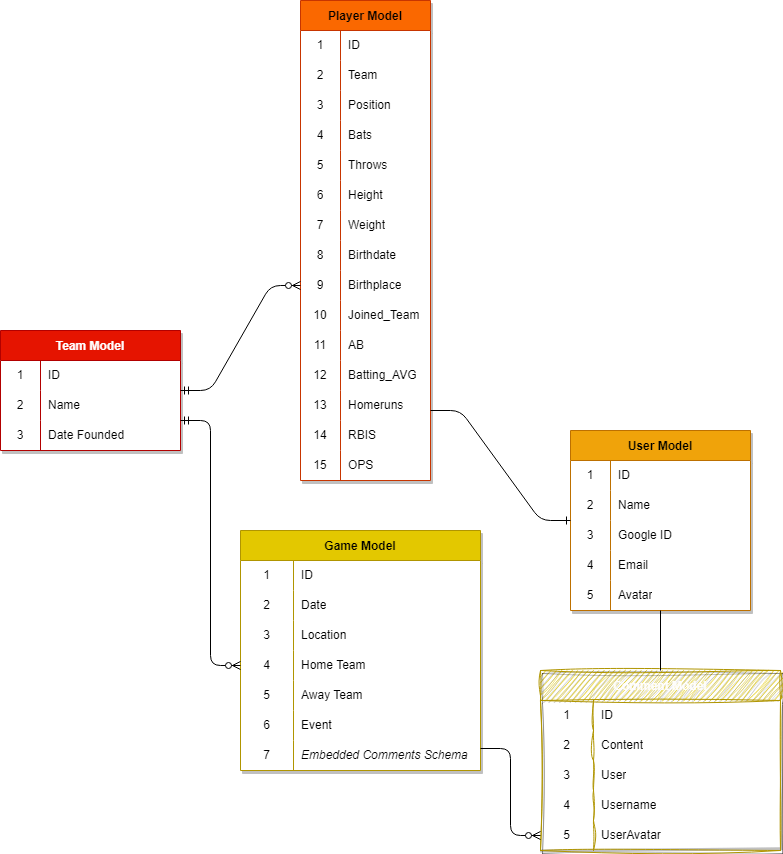

# 

# Project 2 | Baseball Team Tracker | Amanda Putney

The Dingoes are a new baseball team hoping to join the ranks of the Los Angeles Baseball Federation. This full-stack CRUD application will log the player's stats and record the teams activity,

## Project Idea and description

This application will use OAuth authentication to access a database of games played and a team roster with player statisics. There will be comment functionality for the players to discuss post game notes.

## ERDs

## Restful Routing Chart

## Wireframes of all user views

## User Stories

AAU I would like to see a list of past and future games \
AAU I would like to be able to comment on specific games and interact with other users as a way to collaborate with the team \
AAU I would like to update my player statistics in order to track my baseball metrics

## MVP goals/Stretch Goals

Potential to include other teams in the league \
Create an Admin User to monitor QC \
Include Third Party APIs \
<a href = https://www.iqair.com/air-pollution-data-api>-air quality</a> (10,000 calls/month) \
<a href = https://openweathermap.org/api>-weather</a> (30,000 calls/month)\
<a href = https://rapidapi.com/cooperwalter/api/yogia-berra-quotes/>-baseball quotes from Yogi Berra</a> (unlimited calls/month) \
-available baseball fields in LA
